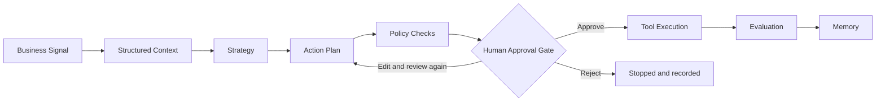
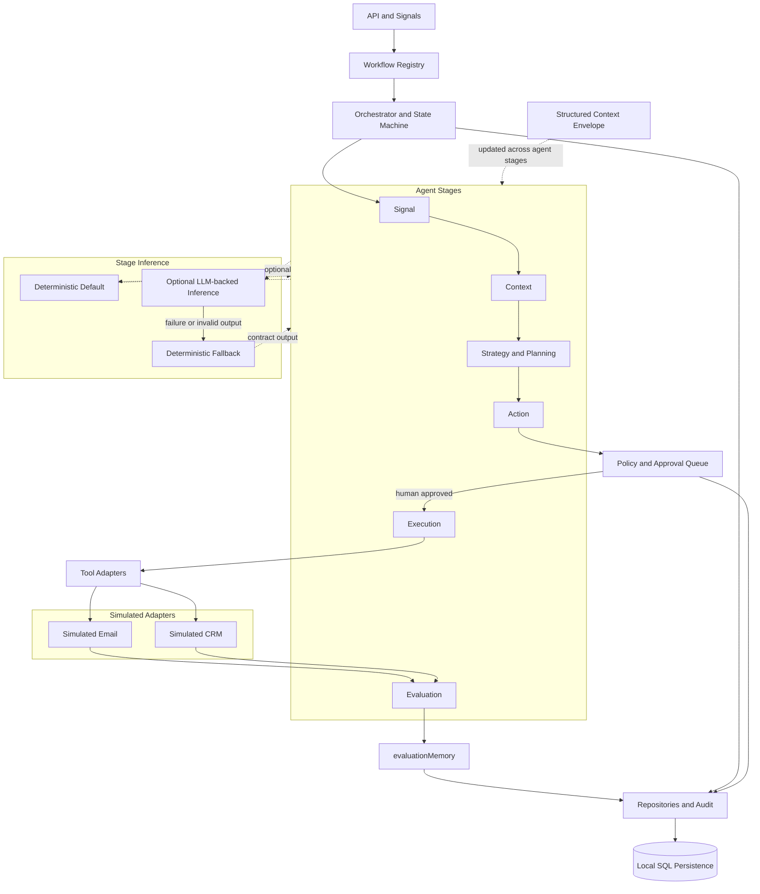

# Workflow and Architecture Diagrams

[Back to README](../README.md) · [Architecture](architecture.md) · [Workflow contracts](workflow-contracts.md)

These diagrams describe the current reference implementation. Email and CRM execution is simulated, persistence is local SQL, and deterministic inference remains the default.

## Business workflow

The approval decision is a required execution boundary: rejected work does not execute, while approved work continues through the simulated tools. Evaluation follows execution, and only evaluated outcomes feed memory.

## Technical architecture

The structured context envelope is updated across the registered agent stages. Those stages use deterministic inference by default; optional LLM-backed inference returns to the same stage contracts, and failures or invalid output take the deterministic fallback path. Neither inference path bypasses policy, approval, or the simulated adapter boundary.

The diagrams intentionally omit future-state services and real customer-system integrations.
